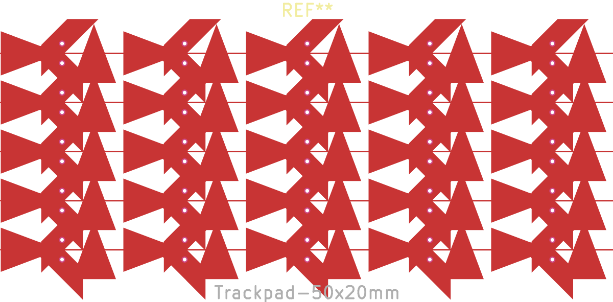
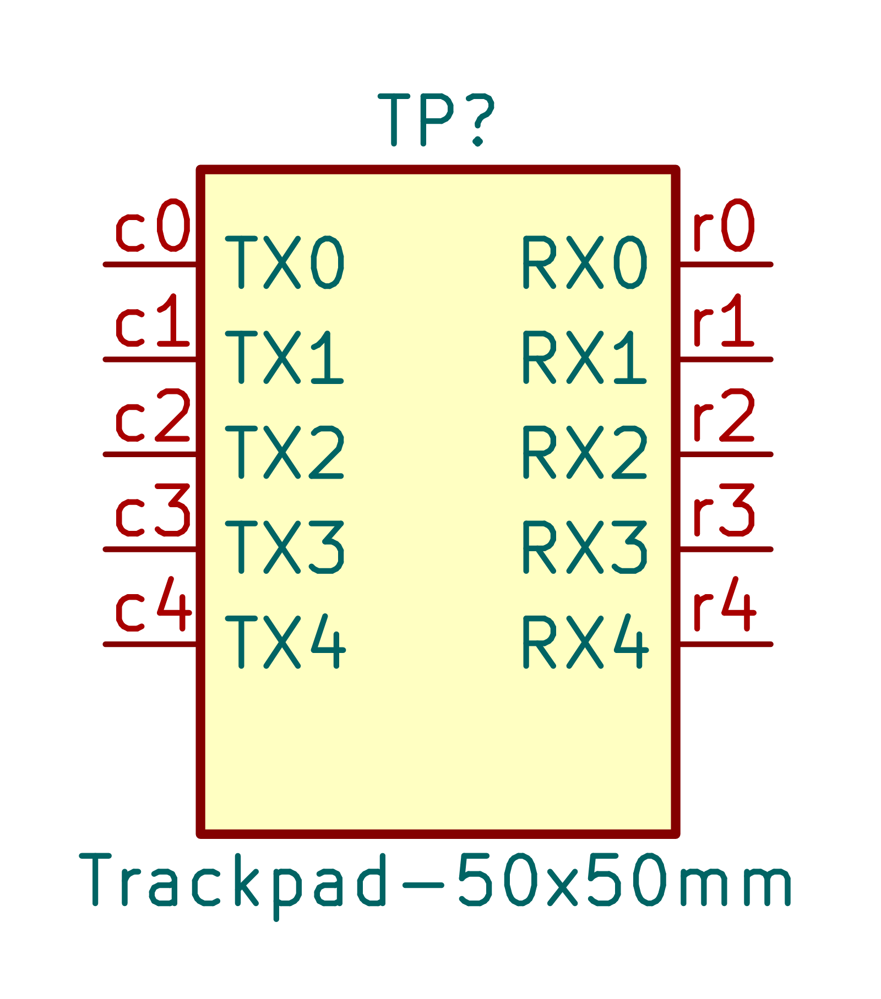

# KiCad Touchpad Wizard

Generates capacitive trackpad PCB footprints **with a matching schematic symbol**
so the pads actually bind to something on the schematic. Works on KiCad 9, 10,
and survives the KiCad 11 SWIG removal because it uses the IPC API
([`kicad-python`](https://pypi.org/project/kicad-python/)), not the old `pcbnew`
bindings.

| Footprint | Matching symbol |
|---|---|
|  |  |

Both images above were generated headlessly by the test suite: `python touchpad_wizard.py emit` writes the `.kicad_mod` and `.kicad_sym`, and `kicad-cli {fp,sym} export svg` renders the previews. No KiCad GUI is ever launched.

## What you get

- One footprint (`Trackpad-WxHmm.kicad_mod`) — interlocking triangular SMD
  electrodes (custom polygon pads), optional routing vias and traces.
- One schematic symbol (`Trackpad-WxHmm`) whose pin numbers (`c0…`, `r0…`)
  exactly match the footprint's pad numbers, and whose Footprint property
  points at the footprint — so symbol → footprint binding is automatic.
- (Plugin/`emit-project` paths) both libraries registered in the project's
  library tables under the nickname `Trackpad`.

## Use it

There are three ways. Pick whichever fits your workflow.

### Option A — In-KiCad plugin (KiCad 9/10, the complete experience)

A **Generate trackpad** button in the PCB editor toolbar. Click it and a
dialog with a live preview opens; hit *Generate into project* and the plugin:

1. writes `Trackpad.pretty/Trackpad-<W>x<H>mm.kicad_mod` into your project,
2. writes/extends `Trackpad.kicad_sym` next to it (symbols accumulate, one
   per size),
3. registers both libraries in the project's `fp-lib-table`/`sym-lib-table`
   under the nickname `Trackpad`, with relocatable `${KIPRJMOD}` paths.

After that the binding is automatic: place the symbol in eeschema, press F8
(*Update PCB from Schematic*), and the footprint arrives on the board wired to
the schematic — the generated symbol's Footprint property already points at
the generated footprint.

Install:

1. Find your KiCad plugin directory:
   - Linux: `~/.local/share/kicad/<version>/plugins/`
   - macOS: `~/Library/Application Support/kicad/<version>/plugins/`
   - Windows: `%APPDATA%\kicad\<version>\plugins\`
2. Clone (or symlink) this repo into a `touchpad-wizard/` subdirectory there.
3. KiCad → Preferences → Plugins → check **"Enable KiCad API"**, then restart
   KiCad. (KiCad writes `kicad_common.json` on shutdown, so flipping the flag
   from a terminal while KiCad runs gets reverted.)
4. Open a project → PCB editor → click the **Generate trackpad** toolbar
   button.

The dialog needs no extra dependencies — it's tkinter, which ships with
Python. KiCad provisions the plugin venv from `requirements.txt`
(`kicad-python`, used only to discover the open project's directory; if that
fails the dialog just asks you to pick the project folder).

Because KiCad reads the project library tables when the project opens, the
*first* generation into a project ends with: close and reopen the project.
Subsequent generations reuse the registered libraries — no reopen needed.

### Option B — Standalone CLI (no KiCad required)

One-shot project integration, same result as Option A:

```bash
pip install kicad-python
python touchpad_wizard.py emit-project \
    --project ~/my-project \
    --width 50 --height 20 --tx-columns 5 --rx-rows 5
```

Or write bare files anywhere and wire the library tables yourself:

```bash
python touchpad_wizard.py emit \
    --width 50 --height 20 \
    --tx-columns 5 --rx-rows 5 \
    --footprint MyProject.pretty/Trackpad-50x20mm.kicad_mod \
    --symbol MyProject.kicad_sym
```

Run `python touchpad_wizard.py emit-project --help` for the full parameter
list (clearance, vias, wiring, connection landings, …).

#### Perimeter connection landings (`--connection-style`)

By default the triangular electrodes are tied together only by their apex vias.
Pass `--connection-style` to add a copper landing on the outer edge of each
perimeter electrode — a flush connection/alignment point. It follows the
solder-mask setting (covered by default, like the electrodes — no exposed copper
on the finger surface).
Because the sensor is self-capacitance, an electrode is a single node, so a
landing appears at **both ends** of every column/row and either is electrically
identical:

- `apex` *(default)* — no extra landing.
- `edge` — a pad spanning the whole outer edge, flush to the boundary.
- `center` — a small pad at the midpoint of each outer edge (alignment aid).
  Size via `--landing-size` (mm).

```bash
python touchpad_wizard.py emit --width 45 --height 45 --tx-columns 5 --rx-rows 5 \
    --connection-style edge --landing-size 1.0 \
    --footprint MyProject.pretty/Trackpad-45x45mm.kicad_mod --symbol MyProject.kicad_sym
```

Side-by-side renders of every style live in
[`artifacts/connection-styles/`](artifacts/connection-styles/) — regenerate them
with `python scripts/regen_connection_gallery.py`.

### Option C — Native footprint wizard (KiCad 10.1+ / 11, future)

The same `plugin.json` also declares a `footprint_wizard`-scoped action that
plugs into KiCad's native *New Footprint Using Footprint Wizard* flow via the
IPC API.

> [!IMPORTANT]
> **This scope does not exist on KiCad 10.0.x.** Verified against the KiCad
> source: the `FOOTPRINT_WIZARD` plugin-action scope was added on master after
> the 10.0.1 tag (missing from `include/api/plugin_action_scope.h` at the
> `10.0.1` tag). KiCad 10.0.1 detects the plugin and provisions the venv, but
> maps the scope to `INVALID` and never surfaces it. Use Option A — the
> toolbar action — on stable KiCad; it provides the same generator plus the
> library-table wiring the native wizard can't do.

On a nightly/11 build: footprint editor → File → New Footprint Using Footprint
Wizard → "Trackpad". The footprint lands in the editor; the matching symbol is
appended to `~/Documents/KiCad/touchpad-wizard.kicad_sym` (override with
`KICAD_TOUCHPAD_WIZARD_SYM_LIB`) since the wizard pipeline itself can only
return a footprint.

KiCad reads `requirements.txt` (not `pyproject.toml`) to provision the plugin's
Python venv, so the file `requirements.txt` at the repo root is what's installed
into the venv at `~/.cache/kicad/<version>/python-environments/<plugin-id>/`.

## How it stays correct

- **Strict types end-to-end.** `pyright --strict` passes; `TrackpadParams` is a
  frozen, slotted dataclass parsed once at the kipy boundary, and downstream
  code consumes typed `PadSpec`/`ViaSpec`/`SegmentSpec` dataclasses — no
  dict-juggling.
- **Headless tests with `kicad-cli`.** Tier 1 tests pure geometry with
  hypothesis property tests. Tier 2 invokes the wizard binary the way KiCad
  does. Tier 3 hands the generated `.kicad_mod`/`.kicad_sym` to `kicad-cli`
  for headless SVG rendering — no GUI, no display, no screen-lock interaction.
  Golden-text snapshots catch any geometric drift.
- **One source of truth for pad numbers.** The geometry layer assigns
  `T1…Tn`/`R1…Rm` once; both the footprint emitter and the symbol emitter
  consume the same list. Numbers cannot diverge.

## Development

```bash
git clone https://github.com/icanc0/kicad-touchpad-wizard
cd kicad-touchpad-wizard
python -m venv .venv && . .venv/bin/activate
pip install -e .[dev]

ruff check trackpad/ tests/ touchpad_wizard.py
pyright trackpad/ touchpad_wizard.py
pytest                       # all tiers
pytest -m "not integration"  # skip kicad-cli rendering
```

CI runs ruff + pyright + pytest on Python 3.10–3.12, plus an integration job
that installs KiCad and renders via `kicad-cli` under `xvfb-run`.

## Legacy SWIG version

The previous SWIG-based wizard (KiCad 8 and early 9) is preserved at the
[`v0-swig-legacy`](../../tree/v0-swig-legacy) git tag. It will not work on
KiCad 11+ because `pcbnew`'s Python bindings have been removed there.
